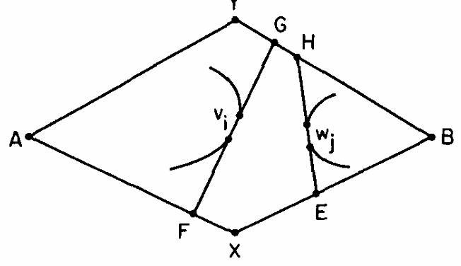

> Author: RACHIK Hilal, KLEIJKERS Jean-Philippe
> 
> Date: October 2024
>
> [Github](https://github.com/Hil4l/Polygon_Intersection) 

## Introduction

problem: determine if two convex polygons P and Q intersect.

## Algorithm 1 (KLEIJKERS Jean-Philippe)

This part of the aims to provide a live visualization of the algorithm [Intersection of Convex Objects in Two and Three Dimensions, developed by B. Chazelle and D. P. Dobkin](https://doi.org/10.1145/7531.24036). The algorithm is applied in a simulation involving two polygons moving within a bounded box, where collisions between the polygons are treated as elastic interactions, resulting in changes to their velocities and directions. This approach allows for a dynamic representation of how the algorithm functions in real-time.

#### Chazelle and Dobkin algorithm

<iframe
  src="https://codesandbox.io/embed/le-w5tx7f?fontsize=14&hidenavigation=1&theme=dark&view=preview"
  style="width: 650px; height: 650px; border: 0; border-radius: 4px; overflow: hidden;"
  title="CodeSandbox Applet"
  allow="accelerometer; ambient-light-sensor; camera; encrypted-media; geolocation; gyroscope; hid; microphone; midi; payment; usb; vr; xr-spatial-tracking"
  sandbox="allow-forms allow-modals allow-popups allow-presentation allow-same-origin allow-scripts"
></iframe>

### Definitions
Let's define X and Y as two convex polygons for the following definitions:
+ **IGL** stands for intersection of convex polygons with a given line.
+ **IGG** stands for intersection of convex polygon with a given convex polygon.
+ **Line of support** The support line of a polygon X (respectively Y) is a line that passes through a vertex of X (respectively Y) and is tangent to Y (respectively X).
+ **Pencil**  The pencil of a polygon X (respectively Y) is a set of two distinct lines of support which passes through the same vertex of X (respectively Y) and are tangent to Y (respectively X).
+ **pivot**  The pivot of a pencil is the vertex of X (respectively Y) through which the two lines of support pass through.
+ **Set L**  The set L of X(respectively Y) is the set of all the vertices of X (respectively Y) contained between the two lines of support of the pencil of X (respectively Y),and the points of intersection of the lines of support with the boundary of X (respectively Y).

### Defining the algorithms
Before defining IGG, we need to define IGL. Because IGG uses IGL several times to find the pencils and the intersection of the pencils with the polygons.

#### **IGL**
IGL takes as input a convex polygon X and a line  L , and returns the two edges of the polygon that are intersected by  L . To find these edges, we use the function  h( pi, L, p1) , which computes the distance between the point   pi  and the line  L , multiplied by   sign( pi, L, p1) . The   sign  function returns 1 if the point pi is on the same side as  p1 , and -1 if it is on the opposite side.

Let’s define  w  as the vertex that minimizes  h( pi, L, p1) . If  h(w, L, p1)  is negative, this indicates that the line  L  passes through the polygon  X . Because the function  h  is bimodal, w can be found  a time complexity of O(log(\|X\|)) using Fibonacci search,were \|X\| is the number of vertices of the polygon X.

Once  w  is identified, we can determine the edges intersected by  L . First, we find the transition from positive to negative values of  h  within the polygonal chain  [p1, w]  using binary search, and the transition from negative to positive values of  h  within the polygonal chain  [w, p1]  by also using binary search. These two transitions correspond to the two edges of the polygon that are intersected by the line  L. Because the complexity of binary search is also O(log(\|X\|)), the overall complexity of IGL is O(log(\|X\|)).

 Example of the function h applied on every vertice of the polygon.

#### **IGG**
### Steps of the algorithm IGG
1. **Find the pencil for polygon P and Q**:
2. **Find the set L for polygon P and Q**:
3. **Reduce  the size of L to keep only the vertices that are necessary to compute the intersection**:
4. **Check for intersection between L of P and L of Q**:

### **Find the pencil for polygon P and Q**
To find the pencil of a polygon P, we need to define a point q which sits inside of the polygon Q,we defined it as the center of mass of the polygon Q. If q sits inside of P, then we can stop the algorithm and return true. Using binary search,we can find if q sits inside of P or not in O(log(\|P\|)) time complexity.
If q is not sit inside of P.We define a pivot p1 as one of the vertices of P and we draw a line that passes through p1 and q.
 Using IGL with as arguments the polygon Q and the line(p1,q), we can find  2 edges and thus the two points of intersection, a and b. If p1  lies on  the segment AB,it means that p1 that P and Q are colliding.

 Example of p1 being on the segment AB.

If  p1 does not lie on segment AB, we can find the two support lines of the pencil, each located on opposite sides of segment AB.
To find the two support lines, depending on the side we are looking for, we can use binary search to find the transition from right to left or left to right turn of the vectors (p1, qi) and(qi, qi+1), where qi and qi+1 are vertices between the edges found by IGL.

 Visual representation of what the binary search is looking for.

This step is also repeated for the polygon Q to find its pencil.   
In total, the time complexity of this step is O(log(n)) where n is total amount of vertices. It is because IGL and the two binary searches each run in O(log(n)), and the process is performed twice. 

 Visual representation of the two pencils.

### **Find the set L for polygon P and Q**
To find all vertices contained between the two support lines of the pencil, we first need to know if the pencil passes through the polygon. To check let's define the pivot of the pencil pi and the two vertices connected to the pivot, pi-1 and pi+1.
If  the oriented angle one of the two support lines of the pencil are less than the oriented angle of the vertor (pi-1,pi) and (pi,pi+1), then the pencil passes through the polygon. This can be checked in O(1) time complexity.

 Example of the pencil Q passing through it, and a counterexample with P.

If the pencil does not pass through the polygon, it means that the set L is empty and we can stop the algorithm and return false, because it means there is no collision. Else, we can find the set L by using IGL with the polygon and the two support lines of the pencil.  By ignoring the edges that contain the pivot, we are left with the other edges that are intersected by the pencil. By taking all the vertices between the intersected edges and adding the intersection points of the support lines with the polygon, we get the set L.

 Example of the set L for the polygon P and Q.

### **Reduce  the size of L to keep only the vertices that are necessary to compute the intersection**
After defining the pencils,we have to verify if the polygone formed by the intersection of the two pencils is a quadrilateral. If it is not, we have to repeat the previous steps with others pivots for P and Q. 

 Example of the quadrilateral formed by the pencils of  P and Q.

If a quadrilateral is formed, the  pivot of P  will be defined  as the point A and the pivot of Q will be defined as the point B. The intersection of the right(repectively left)support line of the pencil of P(repectively Q) with the left(repectively right) support line of the pencil of Q(repectively P) is defined as the point X(repectively Y).
Then we will define the L set of P as Lv and its element vi where i is the index of the vertex. We will also define the L set of Q as Lw and its element wj.

The algorithm for reducing the size of the L sets is recursive, consisting of one default case and five non-mutually exclusive cases. To identify each case, we need to define an operator "<" between two points. This operator is defined as follows:
Let U and V be points. The operation U < V is true if U and V lie on the same side of the segment AB and if U is on the path from A to V. Otherwise, U < V is false. Additionally, we define x and y as follows: x (respectively y) is the path from A to B passing through X (respectively Y).
#### Default case
If the size of the Lw or Lv is less than 6, we can stop the algorithm and return the reduced set.
##### Non-mutually exclusive cases
Let's define i and j as the the middle index of the set Lv and Lw  rounded down to the nearest integer. 
Using i(resp. j) we can define vi(resp. wj) as the vertex of Lv(resp. Lw) at the index i(resp. j).
and vi+1(resp. wj+1) as the vertex of Lv(resp. Lw) at the index i+1(resp. j+1).

Let's now define F and G (respectively H and G) as the intersection of the line(vi, vi+1) (respectively (wj, wj+1)) with the  quadrilateral AXBY.
The Point F (respectively H)  is  chosen such that vi+1  is on the segment(v1, F) (respectively wj+1 is on the segment(w1, H)).

 F E H G on the quadrilateral AXBY

##### Case 1
If G and F are on the path x then we keep: 
&nbsp;&nbsp;&nbsp;Lv = {v1, v2, ..., vi+1,vn}. 
Else if G and F are on the path y then we keep: 
&nbsp;&nbsp;&nbsp;Lv = {vi, vi, ..., vn}. 
For Lw,it is the opposite. 
If G and F are on the path x then we keep: 
&nbsp;&nbsp;&nbsp;Lw = {w1, wj+1, ..., wn}. 
Else if G and F are on the path y then we keep: 
&nbsp;&nbsp;&nbsp;Lw = {w1, w2, ..., wj+1,wn}. 

  
   
  Figure 4a: Illustration of the case 1 from <a href="https://doi.org/10.1145/7531.24036" target="_blank">[2]</a>, page 7

##### "And" condition for the case 2,3,4,5
F and E (respectively H and G) are on the path x (respectively y).
##### Case 2
If F < E and H < G then:
      We return NO,because it means that there is no collision between the two polygons.

  
   
  Figure 4b: Illustration of the case 2 from <a href="https://doi.org/10.1145/7531.24036" target="_blank">[2]</a>, page 7

##### Case 3
Let's definie I be the intersection of segment(G,F) and segment(H,E).
If G < H and E < F then:
&nbsp;&nbsp;&nbsp;if vi is on the segment(G,I) then we keep: 
&nbsp;&nbsp;&nbsp;&nbsp;&nbsp;&nbsp;Lv = {v1, vi, ..., vn}. 
&nbsp;&nbsp;&nbsp;if wj+1 is on the segment(H,I) then we keep: 
&nbsp;&nbsp;&nbsp;&nbsp;&nbsp;&nbsp;Lw = {w1, w2, ..., wj+1,wn}. 
If H < G and F  < E then: 
&nbsp;&nbsp;&nbsp;if vi+1 is on the segment(F,I) then we keep: 
&nbsp;&nbsp;&nbsp;&nbsp;&nbsp;&nbsp;Lv = {v1, v2, ..., vi+1,vn}. 
&nbsp;&nbsp;&nbsp;if wj is on the segment(E,I) then we keep: 
&nbsp;&nbsp;&nbsp;&nbsp;&nbsp;&nbsp;Lw = {w1, wj, ..., wn}. 

  
   
  Figure 4c: Illustration of the case 3 from <a href="https://doi.org/10.1145/7531.24036" target="_blank">[2]</a>, page 7

##### Case 4
If segment(A,vi) and segment(B,wj) intersect then: 
&nbsp;&nbsp;&nbsp;We return true because there is a collision between the two polygons. 

  
   
  Figure 4d: Illustration of the case 4from <a href="https://doi.org/10.1145/7531.24036" target="_blank">[2]</a>, page 7

##### Case 5
Let's define R the intersection of segment(A,vi) and segment(H,E). 
If wj is on the segment(E,R) then we keep: 
&nbsp;&nbsp;&nbsp;Lv= {v1, vi, ..., vn}. 
&nbsp;&nbsp;&nbsp;Lw = {w1, wi, ..., wn}. 
Else 
&nbsp;&nbsp;&nbsp;Lv= {v1, v2, ..., vi+1,vn}. 
&nbsp;&nbsp;&nbsp;Lw = {w1, w2, ..., wj+1,wn}. 

  
   
  Figure 4e: Illustration of the case 5 from <a href="https://doi.org/10.1145/7531.24036" target="_blank">[2]</a>, page 7

#### Complexity
The time complexity of the algorithm is O(log(n)) where n is the sum of the number of vertices of the two polygons. The logaritmic complexity is due to the fact that we approximatively divide by 2 the size of Lw and Lv at each iteration of the algorithm.

###  **Check for intersection between L of P and L of Q**
After recursion if no true or false is returned, we have to check if the two sets of vertices intersect.
So with LW and LV  beeing reduced, we can create a list of edges for each set, corresponding to the enumeration of the vertices within it. Next, we check if the two lists of edges intersect. If they do, we return true, otherwise we return false. The worst-case time complexity of this step is O(\|Lw\| * \|Lv\|), knowing that atleast one of the two has a size smaller than 6.

 Visual representation of the reduce L sets

## Algorithm 2 (RACHIK Hilal)

Barba and Langerman algorithm, aims to show an alternate and hopefully simpler algorithm to solve this problem.

#### Definitions

+ V(P) and E(P) are the set of vertices and edges of P, respectively.
+ ∂P is the boundary of P.
+ edge hull of E is the intersection of the supporting halfplanes of each edges in E.
+ vertex-median of a polygonal chain is a vertex whose removal splits this chain into two pieces that differ by at most one vertex.
+ edge-median of a polygonal chain is an edge whose removal splits the chain into two parts that differ by at most one edge.

#### Structures

Throughout the algorithm, we will interact with the polygons through 2 structures:

+ Tp: the convex hull of three vertices of P (traingle), such that their removal split ∂P into 3 chains of at most ⌈(n−3)/3⌉ vertices.

+ Tq: the edge hull of three edges of Q (triangle - possibly unbounded), such that their removal split ∂Q into 3 chains of at most ⌈(m−3)/3⌉ edges.

 Figure 1: Tp and Tq

(TP ⊆ P while Q ⊆ TQ)

### Invariants

+ **Correctness** invariant: an intersection between P and Q can still be computed with the prunned vertices and edges, P ∩ Q <=> ch(V∗(P)) ∩ E∗(Q).

+ **Separation** invariant: there is a line l that separates TP from TQ such that l is tangent to TP at a vertex v.

+ **Intersection** invariant: there is a point in the intersection between TP and TQ.

Alternate between pruning steps depending on which invariant holds, maintaining correctness invariant.

### Separation invariant step

Define separating line l (exists).

Consider the 2 closed halfplanes l- and l+ supported by l such that TP ⊆ l-.

Consider the 2 neighbours nv and nvp of v along ∂P.

 Figure 2: separation invariant step 2 cases

+ **both neighbours in l-**

  + l separates P from Tq (P convexity) and Q ⊆ TQ so `l separates P from Q`.

+ **neighbours in different halfplanes**

  + The removal of the vertices of TP split ∂P into three polygonal chains, only one, let cv, intersects l+, we consider its both endpoints v (by construction) and let u the other one.

  Because Q ⊆ l+, only cv vertices can define an intersection with Q (other points not in the same halfplane - separated).
  Therefore, we can `prune V∗(P) by removing every vertex of P that does not lie on cv and maintain the correctness invariant`.

  + Redefine Tp with (v, u, m), m the vertex-median of cv.

  + Test Tp and Tq for intersection and perfrom corresponding invariant step.

### Intersection invariant step

Consider (e1, e2, e3) the 3 edges whose edge hull defines Tq.

+	**Tp intersects ch(e1, e2, e3)**

	ch(e1, e2, e3) ⊆ Q so `P and Q intersect`.

+	**Tp dont intersects ch(e1, e2, e3)**

	+ Tq \ ch(e1, e2, e3) forms 3 disjoint connected components, Tp intersects exactly one of them, let it be the one bounded by (e1,e2) and let x ∈ ∂Tq such an intersecting point.

	+ Let C the polygonal chain that connects e1 with e2 along ∂Q such that it passes through e3.

	+ If P and Q intersect, we only need to consider the edges on ∂Q\C,

	If P intersects C at a point y, x and y lies in 2 different disjoint connected components of TQ/ch(e1,e2,e3), so xy intersects ∂Q at anpother point in ∂Q/C, so any intersection between P and Q through C also involves an intersction through ∂Q/C.

	Therefore, we can `prune E∗(P) by removing every edge along C and maintain the correctness invariant`.

	+ Redefine T_q as the edge hull of (e1, e2, em), em the edge-median of ∂Q \ C edges.

	+ Test Tp and Tq for intersection and perfrom corresponding invariant step.

 Figure 3: intersection invariant step 2 cases

### Separation invariant applet

<iframe
  src="https://codesandbox.io/embed/separation-invariant-j73nhp?fontsize=14&hidenavigation=1&theme=dark&view=preview"
  style="width: 100%; height: 500px; border: 0; border-radius: 4px; overflow: hidden;"
  title="CodeSandbox Applet"
  allow="accelerometer; ambient-light-sensor; camera; encrypted-media; geolocation; gyroscope; hid; microphone; midi; payment; usb; vr; xr-spatial-tracking"
  sandbox="allow-forms allow-modals allow-popups allow-presentation allow-same-origin allow-scripts"
></iframe>

### Complexity

+ Each time Tp is redefined, we roughly splits the remaining vertices of V*(P) along ∂P into 2 equal lenght chains through the vertex median (v and u are adjacent by construction).
Therefore, after each separation invariant step, a constant fraction of V∗(P) is prunned since only one chain is retained (cv).
So the number of separation invariant step is bounded by O(log |P|).

+ Each time Tq is redefined, we roughly split the remaining edges of E∗(Q) into equal pieces, through the edge median (e1 and e2 adjacent by construction).
Therefore, after intersection invariant step, a constant fraction of E∗(Q) is prunned, since only ∂Q \ C is retained.
So the number of intersection invariant step is bounded by O(log |Q|).

Overall complexity is `O(log(|P|) + log(|Q|))`

## References
[1] [Barba, Luis, and Stefan Langerman. "Optimal detection of intersections between convex polyhedra." Proceedings of the Twenty-Sixth Annual ACM-SIAM Symposium on Discrete Algorithms. Society for Industrial and Applied Mathematics, 2014.](https://arxiv.org/abs/1312.1001)

[2] [B. Chazelle and D. P. Dobkin. Intersection of Convex Objects in Two and Three Dimensions.1–27, January 1987.](https://doi.org/10.1145/7531.24036)